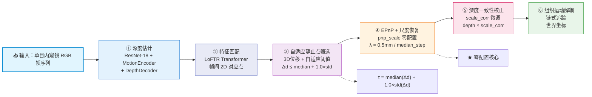
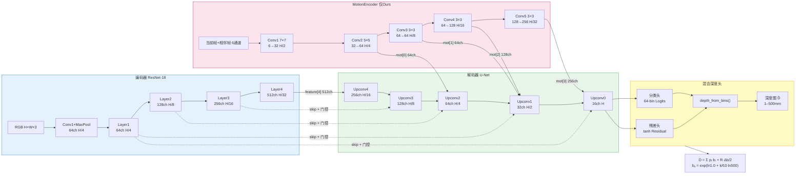
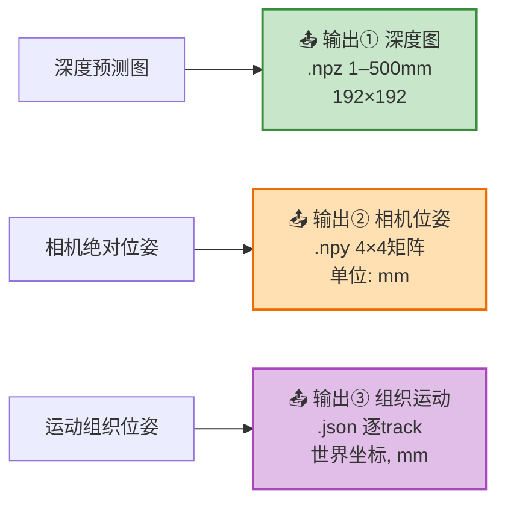

# 图1 本文方法总览

---

## 区域A：总体管线（6阶段横向流程）

---

## 区域B：深度估计网络结构（编码器-解码器）

---

## 区域C：三路输出

---

## 关键公式标注

| 位置 | 公式 |
|------|------|
| 区域A 阶段③ | \( \tau = \text{median}(\Delta d) + 1.0 \times \text{std}(\Delta d) \) |
| 区域A 阶段④ | \( \lambda = \frac{0.5\text{mm}}{\text{median}(\text{PnP\_step})} \) ★ 零配置核心 |
| 区域B 输出头 | \( D = \sum p_i \cdot b_i + R \cdot \frac{\Delta b}{2} \) |
| 区域B bin分布 | \( b_k = \exp(\ln 1.0 + \frac{k}{63} \cdot \ln 500), \quad k = 0,1,...,63 \) |

---

## 性能指标（EndoSLAM c1_transverse1_t1_v2）

| 指标 | Ours | Monodepth2 | ManyDepth | Lite-Mono |
|------|------|-----------|-----------|-----------|
| ATE ↓ | **5.08 mm** | 7.15 mm | 9.18 mm | 7.84 mm |
| RPE-T ↓ | 0.39 mm | 0.27 mm | 0.31 mm | **0.13 mm** |
| RPE-R ↓ | **0.43°** | 2.44° | 2.06° | 2.08° |
| Scale Err ↓ | **24.97%** | 159.22% | 54.89% | 198.13% |
| 成功率 ↑ | **100%** | 96.6% | 93.1% | 88.8% |

---

> **图1 本文方法总览**
> Fig.1 Overview of the proposed method

渲染工具：VS Code (Mermaid插件) 或 https://mermaid.live
